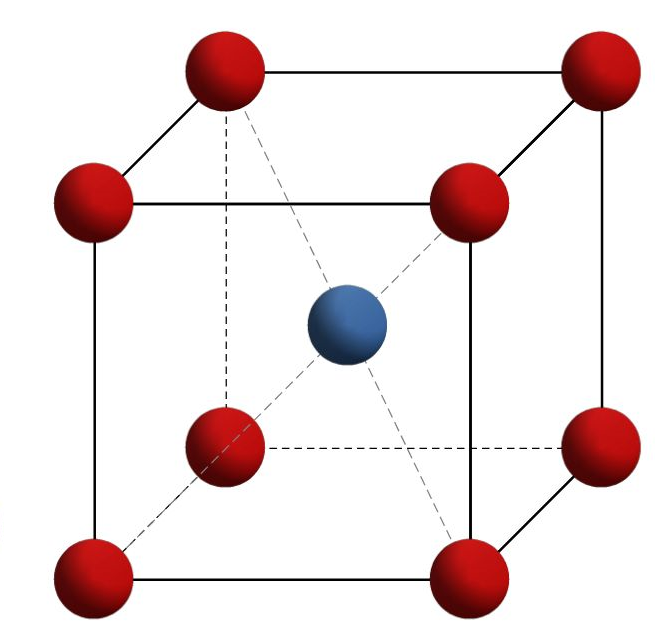

## Materials-and-Production-Engineering - Materials
Prof. Dr.-Ing. Christian Willberg
Hochschule Magdeburg-Stendal

Contact: christian.willberg@h2.de
Parts of the script are adopted from \
Prof. Dr.-Ing. Jürgen Häberle

 
    <a href="https://doi.org/10.1007/s42102-021-00079-6" style="color: blue;">Image Reference</a>

---

<!--paginate: true-->

## Lecture

**Framework**

- Eating or drinking is okay, but quietly
- Problems with childcare
- Everything stays in the room!
- Questions

---

## Content

- Materials
- Structure of materials
  - Atoms and bonds
  - Fine structure
  - Microstructure
- Structure of materials
- Material properties
  - physical
  - non-physical
- Phase diagrams
- ...

---

## Materials

What are materials?

[Materials in the narrow sense are solid-state materials that can be used to make components and constructions.](https://de.wikipedia.org/wiki/Werkstoff)

---
## Application Areas 

- Metals
  - Iron steel 
  - Non-ferrous
- Plastics
- Ceramics
- Composites

---

## Cast Iron - Steel

---

## Non-Ferrous Metals

- Copper is a very good electrical and thermal conductor

---

- Magnesium is used in lightweight construction
- Titanium and titanium alloys 
    - high strength and heat resistance
    - Corrosion resistant
- Nickel
    - Corrosion resistance
    - high heat resistance

---

## Ceramics

---

## Glasses

---

## Fiber Composites

---

# Structure of Materials

---

-	Atomic structure (type of atomic building blocks)
-	Fine structure (bonds between atomic building blocks and their geometric arrangement)
-	Microstructure (structure - areas of geometric arrangement separated by interfaces inside the material)
-	Macrostructure (coarse structure - overall appearance of a material during production and application of a component)

---

# Bonds

## Primary Bonds  
**Primary bonds - high bond energy, strong bond**
-	Ionic or heteropolar bond 
-	Covalent bond: polar (O-H) and non-polar (C-C, C-H)
-	Metallic bond

---

## Metallic Bond

- Valence electrons are only weakly bound
- a lattice (periodically arranged) of positively charged metal ions (atomic cores) is formed
- Valence electrons can move almost freely within the lattice, known as **electron gas**
- Results: good electrical conductivity + high thermal conductivity

---

---
## Relevant Quantities

**Atomic number**
Number of protons in the nucleus
**Atomic mass**
Defines the mass of the element
The mass of the material is a combination of atomic mass and density
**Electronegativity**
Defines whether atoms are donated or accepted in a bond
Metallic bonds tend to the left
Covalent bonds tend to the right

---

## Secondary Bonds 
**Secondary bonds - low bond energy, weak bond**
-	Van der Waals bond: intermolecular forces
-	Hydrogen bond: two molecules or two suitably distant parts of a macromolecule interact via hydrogen atoms
- The bond energies are one to two orders of magnitude smaller than atomic bonds.

---

| **Name** | **Ionic or heteropolar bond** | **Covalent homopolar (covalent) bond** | **Metallic bond** |
|----------|-------------------------------|---------------------------------------|-------------------|
| **Components** | Ions (metal + non-metal) | Same atom type (non-metal + non-metal) | Same atom type (metal + metal) |
| **Description of electrical charge state** | Positively charged ion + negatively charged ion (cation + anion) | Atoms have one or more shared electron pairs to reach noble gas configuration | Atoms donate their valence electrons to the whole bond. Electrons move freely in the lattice |
---

## Atomic Structure

Consists of
- Nucleus (Protons + Neutrons) which defines the mass
- Shell (Electrons) with various layers that define chemical and many physical properties

---

---

### Fine Structure
- Crystal structures
- Molecular structures
- Glassy-amorphous structures
- Real structure

---
## Space Lattice

- Formed by the three-dimensional periodic shift of its components
- Characterized by three spatial axes x, y, and z, with angles α, β, γ and distances on the axes defining the respective space lattice
- a₀, b₀, and c₀ (lattice constants) -> Unit cell

---

| Crystal System    | Lattice Constants       | Angles         | Examples                                                  |
|------------------|-------------------------|----------------|-----------------------------------------------------------|
| Triclinic         | a₀ ≠ b₀ ≠ c₀            | α ≠ β ≠ γ ≠ 90° | Silicate minerals                                          |
| Monoclinic        | a₀ ≠ b₀ ≠ c₀            | α = γ = 90°; β ≠ 90° | Mo₂S₃; β-Pu                                                |
| Orthorhombic      | a₀ ≠ b₀ ≠ c₀            | α = β = γ = 90° | U, S, P, Ga, γ-Sn                                          |
| Rhombohedral      | a₀ = b₀ = c₀            | α = β = γ ≠ 90° | As, Hg, Sb                                                 |
| Hexagonal         | a₀ = b₀ ≠ c₀            | α = β = 90°; γ = 120° | α-Ti, Mg, Zn                                               |
| Tetragonal        | a₀ = b₀ ≠ c₀            | α = β = γ = 90° | B, CuTi₃, Sn (T > 13.5°C)                                  |

---

## Common Lattice Structures in Metals

| Crystal System    | Lattice Constants       | Angles         | Examples                                                  |
|------------------|-------------------------|----------------|-----------------------------------------------------------|
| Cubic             | a₀ = b₀ = c₀            | α = β = γ = 90° | Cu, Al, Ni, Au, Ag; γ-Iron (FCC); α-Iron, V, Cr, W (BCC); Mn, Po (SC) |

---

Face-Centered Cubic (FCC)

Body-Centered Cubic (BCC)

Hexagonal Close-Packed (HCP)

---

## Influences

- **Corrosion**: Aggressive media attack preferred planes.
- **Deformation**: Plastic deformation occurs along preferred crystallographic planes and directions → Slip systems.
- **Ultrasound**: Use of quartz crystals with specific crystallographic surfaces.
- **Conductivity**: Use of germanium or silicon wafers in (1 1 1)- or (1 0 0)- orientation for semiconductor elements.
- **Magnetization**: Easiest magnetization of iron-silicon transformer sheets along the cube edge [1 0 0].

---

## Polymorphism in Metals

- **Polymorphism**: Formation of different lattice structures depending on temperature.
- The different lattice forms are the allotropic modifications.

(Also: Carbon polymorphism: graphite, diamond, etc.)

---

## Determining Transformation Points

_Dilatometry_
- Measurement of length changes due to lattice transformation.

_Thermal Analysis_
- Recording of the temperature curve.
- Lattice transformations (phase changes) require or release thermal energy.
- Holding or inflection points in heating or cooling curves.

- Holding points: In pure metals.

---

---

## Molecular Structures

- Typical for non-metallic organic materials.
  - Natural materials: Wood, rubber, leather, fibers, etc.
  - Synthetic plastics: PMMA, epoxy, etc.

---

- Formed by assembly reactions of monomeric building blocks into chain molecules.
- Atomic bonds occur within the chains.
- Van der Waals forces and molecular entanglements exist between the chains.

---

## Assembly Reaction (Polymerization)

- Free bonds must be created in the monomers.
- The monomers "need" new partners to reach an energetic minimum.

---

## Chain Polymerizations

  - Breaking of C=C double bonds in the monomer (catalytic process through pressure, temperature, catalyst).
  - Linking the split monomers to macromolecules.

---

## Step-Growth Reactions

**Polycondensation**
- Release of low molecular weight reaction products (e.g., H₂O) through a chemical reaction creates free bonds.
- Stepwise reaction or interruption leads to the formation of linear, branched, or cross-linked polymers (thermoplastics, elastomers, or thermosets).

---

**Polyaddition**
- Free bonds are formed by rearrangement of double bonds between two different monomer molecules.
- These then form molecular chains.

---

## Glassy-Amorphous Structures

- Glasses are non-metallic inorganic, primarily silicate melt products.
- They are in a non-crystalline (amorphous) state.
- In glass, the melt is first undercooled and then "frozen" below the transformation temperature (Tg).

---

# Material Properties
- Properties are significantly influenced by the microstructure and electrons (outer shell).

**Work Function**
- Thermal expansion
- Electrical conductivity
- Thermal conductivity

