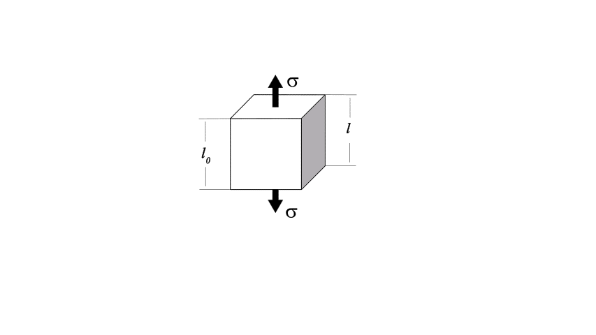
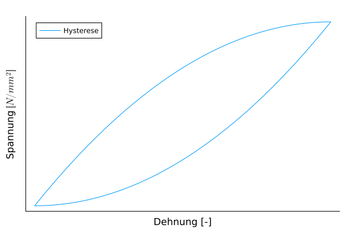

## Materials-and-Production-Engineering-Lecture Materials Science - Lecture on Real Structures and Properties
Prof. Dr.-Ing. Christian Willberg
Hochschule Magdeburg-Stendal

Contact: christian.willberg@h2.de
Parts of the script are taken from \
Prof. Dr.-Ing. Jürgen Häberle

---

## Objectives
- Defects in crystals
- Plasticity
- Basics of mechanical properties

---

<!--paginate: true-->

# Real Structure of Crystals
## Lattice Defects

- Zero-dimensional defects (point defects): vacancies, interstitial atoms, interstitial foreign atoms, substitutional foreign atom
- One-dimensional defects (line defects): dislocations
- Two-dimensional defects (surface defects): stacking faults, grain boundaries, subgrain boundaries, phase boundaries

---

## Zero-dimensional Defects

What are the possible variants?

- Interstitial atoms
- Vacancies
- Frenkel type (occurrence of the same number of interstitial atoms and vacancies)
- Substitutional foreign atom
- Interstitial foreign atom 

---

## Foreign Atoms

How can foreign atoms be used?

- [Doping](https://en.wikipedia.org/wiki/Doping_(semiconductor)) in semiconductors
    - targeted manipulation of electrical conductivity by introducing additional atoms
- Interstitial and substitutional foreign atom
    - increase in strength through natural "crack stopping" or locally easier dislocation and reduction of local stresses

---

## Dislocations

[Dislocations](https://en.wikipedia.org/wiki/Dislocation_(materials_science)) occur
- during crystal growth
- due to residual stresses
- through plastic deformation

---

## Two-dimensional Defects - Grain Boundaries
- Grain boundaries
- Phase boundaries
- Subgrain boundaries

[Script](https://cwillberg.github.io/Werkstofftechnik/dev/Skript/svw/gitterbaudefekte/)

---

## Plasticity

Good or Bad?

---

## Examples

**High plasticity**:

- Modeling clay
- Wet clay
- Metals and metal alloys with a suitable atomic lattice:
  - glowing steel in forging
  - cold forming of sheets 

**Low plasticity**:
  - Rubber
  - Ceramics
  - Fiber-reinforced composites (epoxy-glass fiber or epoxy-carbon fiber)

---

## Plasticity - Single Crystal

The plastic deformation of a crystal mainly occurs through the sliding of atomic layers along certain crystallographic planes and directions under the influence of shear stress.

- The slip system consists of a slip plane and a slip direction.
- Critical shear stress ($\tau_{Cr}\approx G/10$ - estimate or theoretical shear strength)
- Reality is ~100 times lower due to dislocations

---

## Image

---

## Plastic Deformation of Polycrystalline Material

- Micro- and macroplasticity
  - Plastic deformation starts at "unfavorable" orientations
- Grain boundaries
  - Barrier to dislocation motion
  - At high temperatures, grain boundaries can slide (creep)
  - Targeted manufacturing can increase toughness through grain boundaries
- Heterogeneity
  - Multiphase materials
  - Inhomogeneous distribution of stresses and deformations
- Anisotropy

---

## Polycrystal Plasticity
[Example from a simulation](https://www.youtube.com/watch?v=mWanREXKLO4)

---

## Yield Strength

- $R_m$ - tensile strength
- $R_e$ - yield strength
- Offset yield strength or elastic limit $R_{p0.2}$
  - After loading and unloading, 0.2% strain remains
- Offset yield strength is used as a substitute for yield strength

---

## Yield Strength

- Upper yield strength $R_{eH}$
- Lower yield strength $R_{eL}$
>Jagged area: Lüders region

[Example video](https://youtu.be/E80yUNniESU?si=pqGRAWamxFQedWqw&t=95)

---

## Plasticity - Forming
- [Deep drawing principle](https://www.youtube.com/watch?v=Zbfld_851z0)
- [Deep drawing in reality](https://www.youtube.com/watch?v=rHfepOqPVHI)

---
## Material Properties

What are material properties?

<!DOCTYPE html>
<html lang="en">
  <body>
    <pre align="center" class="mermaid">
    %%{init: {'theme': 'forest'}}%%
    mindmap
      root((Properties))
        Physical
          Mechanical
          Electrical
          Thermal
          ...
        Chemical
            Solubility
            Electronegativity
            ...
        Biological / Physiological
            Environmental Impact
            Weatherability
            Toxicity
            ...
        Social / Societal
            Value
            Acceptance
            Working Conditions
            Origin
            ...
    </pre>
    
  </body>
</html>

<!DOCTYPE html>

---

## Symmetry
- Isotropy
- Transverse Isotropy
- Orthotropy
- ...
- Anisotropy

<!---
- Discussion; properties can be direction-dependent
- Practical examples
-->

---

## Mechanical Properties

- **Reversible** deformation, where immediately or after a certain time following the application of external load, the deformed material returns to its original shape: elastic and viscoelastic deformation.

- **Irreversible (permanent)** deformation, where the shape change remains even after the external load is removed: plastic and viscous deformation.

- Fracture, i.e., separation of the material caused by the formation and propagation of cracks.

---

## Simulation Example

<iframe src="https://perilab-results.nimbus-extern.dlr.de/models/DCB?step=65&variable=Damage&displFactor=400" width="1150" height="600"></iframe>

---

## Concept of Stress - Strain

- Geometry-independent characteristics
- How can one determine a characteristic that is defined solely by the material?
- Example: Density

---

## Elasticity

- Reversible, energy-preserving
- Hooke's Law 1D
Normal stress $\sigma = E\varepsilon$
Shear stress $\tau = G\gamma$

---

## Basics

- Normal strain [-]
$\varepsilon_{mechanical} = \frac{l - l_0}{l_0}$

- Normal stress $\left[\frac{N}{m^2}\right]$, $[Pa]$
$\sigma = \frac{F}{A}=E\varepsilon$
E - Elastic modulus, Young's modulus $\left[\frac{N}{m^2}\right]$\
\
\
\
\
.

 
    

---

## Basics

- Shear strain [-]
$\varepsilon = \frac12(\frac{u_x}{l_0}+\frac{u_y}{b_0})=\frac{\gamma}{2}$

- Shear stress $\left[\frac{N}{m^2}\right]$, $[Pa]$
$\tau = \frac{F_s}{A}= G\gamma$

- Normal and shear stresses are not compatible, leading to the concept of equivalent stresses -> Engineering Mechanics

- G - Shear modulus $\left[\frac{N}{m^2}\right]$

---

## Basics

- Poisson's ratio [-]
$\nu = -\frac{\varepsilon_y}{\varepsilon_x}$
for homogeneous materials $0\leq\nu\leq 0.5$
for heterogeneous materials, other configurations are possible

- [Bulk modulus](https://en.wikipedia.org/wiki/Bulk_modulus#Relation_between_elastic_moduli) $K = \frac{E}{3(1-2\nu)}$
- [Shear modulus](https://en.wikipedia.org/wiki/Bulk_modulus#Relation_between_elastic_moduli) $K = \frac{E}{2(1+\nu)}$

---

## Material Examples

| Material                          | E [GPa]   | G [GPa] | $\nu [-]$     |
|:----------------------------------|:----------|:--------|:--------------|
| Unalloyed steel                   | 200       | 77      | 0.30          |
| Titanium                          | 110       | 40      | 0.36          |
| Copper                            | 120       | 45      | 0.35          |
| Aluminum                          | 70        | 26      | 0.34          |
| Magnesium                         | 45        | 17      | 0.27          |
| Tungsten                          | 360       | 130     | 0.35          |
| Cast iron with lamellar graphite  | 120       | 60      | 0.25          |
| Brass                             | 100       | 35      | 0.35          |
| Thermoplastics / Thermosets       | 2 … 5     | 1 … 2   | ~0.35         |
| Elastomers                        | 0.1       | 0.03    | 0.45 - 0.49   |
| Plywood                           | 4 … 16    | -       | -             |
| Concrete                          | 40 … 45   | -       | -             |

---

## Stiffness

How are material properties related to stiffness?

- Material $\cdot$ cross-sectional area = stiffness
- Tensile, normal stiffness = $EA$
- Bending stiffness = $EI$
- Torsional stiffness = $GI_P$

 
    <a href="https://doi.org/10.3390/en14092451" style="color: blue;">Image reference</a>

---

## 
<!---

* 1st and 2nd natural frequencies ->  https://doi.org/10.3390/en14092451
* Deformation in the impact and swing direction are identical
* Tower impact is relevant
* Dynamic stability
* -->

 
    <a href="https://doi.org/10.3390/en14092451" style="color: blue;">Image reference</a>

---

## Strength

[The strength of a material describes its ability to withstand mechanical loads before failure occurs and is expressed as mechanical stress $\left[N/m^2\right]$. Failure can involve **unacceptable deformation**, particularly **plastic (permanent) deformation**, or **fracture**.](https://en.wikipedia.org/wiki/Strength_of_materials)

>Important: Strength $\neq$ Stiffness

---

## Plastic Failure

 
    <a href="https://commons.wikimedia.org/w/index.php?curid=89891144" style="color: blue;">By Nicoguaro - Own work, CC BY 4.0</a>

---

## Viscous Behavior

- Reversible
- Time-dependent

Spring model $\sigma = E\epsilon$ 
 - Elastic component
 - Represented by spring elements

 
    

 
    

Damper  $\sigma = \eta\dot{\epsilon}=\eta\frac{\partial \epsilon}{\partial t}$ 
- Viscous component
- Represented by damper elements

---

## 

---

## 

---

## Excursion: Modeling of Materials
- Rheological models
- Consist of many springs, dampers, and other elements
- These degrees of freedom ($E_i$, $\eta_i$) are then fitted
