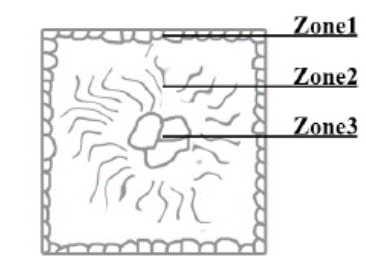

## Lecture on Materials Science - Microstructure of Materials
Prof. Dr.-Ing. Christian Willberg
Magdeburg-Stendal University of Applied Sciences

Contact: christian.willberg@h2.de
Parts of the script are adopted from \
Prof. Dr.-Ing. Jürgen Häberle

---

<!--paginate: true-->

## Contents

- Basic Concepts
- Crystal Formation
- Phase Diagrams
- Microstructure

---

# Terms

## Alloy
- from "ligare" - to bind, join, unite
- Mixture of several atomic species (_components_) with _metallic character_
- Components
  - usually metallic (Cu, Ni)
  - non-metallic (C, P, S, N, O)
- Variations
  - which components
  - number of components
  - concentration of components
---

## Chemical Composition or Concentration
**Mass fraction, weight fraction, mass percent (synonyms)**
$\frac{m_1}{\sum_i m_{i}}\cdot 100 = m_{1-rel}$ in [%]
Ex. $m_{Cu-rel}=\frac{m_{Cu}}{m_{Cu}+m_{Fe}}\cdot 100$

Masses $m$ of components are different

**Atomic fraction**

$\frac{n_1}{\sum_i n_{i}}\cdot 100 = n_{1-rel}$ in [%]
Ex. $n_{Cu-rel}=\frac{n_{Cu}}{n_{Cu}+n_{Fe}}\cdot 100$

When the masses $m$ of components are similar, then $n_{rel}$ and $m_{rel}$ are equal. 

---

## Exercise

1 kg alloy 25% Ni - 75% Cu.

How much mass does Cu and Ni have for the mass fraction and atomic fraction?

---
## Solution

Mass fraction

$m_{Ni}=0.75\cdot 1kg = 0.75 kg$
$m_{Cu}=0.25\cdot 1kg = 0.25 kg$

Atomic fraction

$A_{Cu}= 63.54 u$ - atomic mass unit $u = 1.66\cdot 10^{-27}kg$
$A_{Ni}= 58.69 u$
$m = n_{Cu}A_{Cu}+n_{Ni}A_{Ni}$
$n_{Cu} = 0.25n$, $n_{Ni} = 0.75n$
$m=(0.25A_{Cu}+0.75A_{Ni})n$
$n = \frac{m}{0.25A_{Cu}+0.75A_{Ni}}=1.00565E+25$
$m_{Cu}=n_{Cu}A_{Cu}=0.2449kg$
$m_{Ni}=n_{Ni}A_{Ni}=0.7551kg$

---

## Phase

- Known in relation to the state of matter (solid, liquid, gaseous, plasma)

**General definition**
A phase is understood as a chemically and physically homogeneous component of an alloy or matter in general.

---

Single-phase

- pure aluminum
- pure iron
- water

Two-phase

- fog
- supersaturated solutions

Solid solution

A solid solution is a chemically homogeneous, uniform crystal made up of several types of atoms.

---

## Types of Solid Solutions

Substitutional solid solution
- similar chemical character
- similar diameter
- same crystal lattice

---

Interstitial solid solution
- smaller atoms
- placed in the gaps of the crystal lattice (interstitial or interstitial atoms) 
- second component is dissolved

_Both types are single-phase._

---

## Intermetallic phase

- mostly complex lattice structure, independent of the original lattices
- ordered interstitial structures
- not a compound in the chemical sense (law of constant and multiple proportions does not apply)
- predominant bond type: metallic bond, but with added atomic and ionic bond components

Characteristic: hard and very brittle

---

# Microstructure of Materials

- characterized by the type, size, shape, orientation, and arrangement of individual components (phases), such as crystallites (grains), amorphous regions, reinforcements, or fillers

---

## Formation of Microstructure

Melt  → Cooling / Undercooling
↓
Nucleation (homogeneous + heterogeneous)
↓
Crystal growth → Crystallization
↓
Formation of crystallites (grain formation with grain boundaries)
↓
∑ of all grains and grain boundaries 	=>    Microstructure

---

## Nucleation
- Solidification does not occur uniformly -> formation of nuclei
- homogeneous (same type) or heterogeneous (different type) 
- Growth of nuclei (crystal growth) until the entire melt has solidified
- There are relationships between the number of nuclei (NN) and the crystallization speed (CS) on one hand and the undercooling ΔT on the other.

---
## Influencing Factors on Grain Size Formation

a) → fine-grained microstructure  $\qquad$	b)  → coarse-grained microstructure

- large number of nuclei -> fine-grained microstructure
- rapid crystal growth and low NN -> coarse-grained microstructure

---
## Terms
Grain 
- Nuclei have completed growth and touch each other
- Crystal orientation between adjacent grains is generally different
- Shape and size are determined by heat flow
  - uniform in all directions - _globular_
  - preferred direction of heat flow - _transcrystalline solidification_

Grain boundary 
- Transition areas between grains

---

## Casting or Continuous Casting

- During casting or continuous casting in a metal mold (ingot mold), a casting structure forms in three zones, usually with a clear demarcation between them:

---

1.	Fine-grained globular boundary zone

- strong undercooling of the melt at the mold wall
- formation of numerous crystal nuclei -> small, uniform crystallites

---

2.	Transcrystallization zone with stem-like, very coarse crystallites

- directed growth of crystallites (stem crystals), where the crystallographic orientation aligns with the direction of the heat gradient;
- the orientation that arises from this => casting texture 

---

3.	Globular core zone
- impurities are pushed ahead by the stem crystals and accumulate in the core
- high number of different-type nuclei 
- fine-grained globular core zone 
- In very pure metals, however, a coarse-grained structure is found in the third zone

---

# Microstructure Detection

- Generally, individual crystallites (grains) in a material are not visible to the naked eye. 
- For materials science investigations, however, it is necessary to analyze the existing microstructure. 
- Work steps:
  - targeted sample extraction 
  - grinding and polishing the sample
  - etching the surface

---

## Metallographic Sections
- A carefully prepared section can be viewed with a light or scanning electron microscope. 
- The scanning electron microscope not only offers significantly higher resolution but also greater depth of field.

---

## Etching
Etching for microstructure development can also be regarded as a corrosion process.

Grain boundary etching
- preferential dissolution of grain boundaries

---

Grain surface etching
- adjacent grain sections are roughened or covered with oxide layers to different extents
- grains reflect light differently 

---
## Macro Sections

Using macro etching, only those microstructural phenomena that are visible to the naked eye or under a magnifying glass can be studied. The following analyses are possible:
- Segregation and its localization: Heyn and Oberhoffer etching or Baumann print
- Quality of welds: Adler etching
- Development of force flow lines after plastic deformation: Fry etching

---

## Terms for the Qualitative and Quantitative Description of Microstructures

Metallography - Metals  
Ceramography - Ceramics  
Plastography - Polymer materials

---

# Phase Diagrams

- Also known as phase diagram
- Represents the state of alloys and material mixtures depending on chemical composition, temperature, and sometimes pressure
- The state refers to the phases present (all solid, liquid, gaseous)

---

## Attention!

Phase diagrams are equilibrium diagrams. They are only valid for very slow cooling from the molten state to room temperature, where equilibrium between the phases (at or between phase boundaries) can be established.

---

---

## Solubilities

Insoluble

- Too large differences in atomic diameters
- Crystal lattices differ from each other
- Components are chemically very different

Soluble

- Hardly any differences in atomic diameters
- Crystal lattices are identical
- Components are chemically very similar

---

## Example from Experience
- Oil film on water is insoluble and separates due to the difference in density
- Salt/sugar crystals in water dissolve completely and become invisible

---

# Phase Diagrams (ZSD)

---

- Phases and phase boundaries can be represented as a phase diagram
- The number of phases in equilibrium is governed by the number of alloy components and the number of degrees of freedom according to the Gibbs Phase Rule
- A degree of freedom includes the possible change of state variables without changing the equilibrium (i.e., the number of phases)
- The number of freely selectable state variables is determined by the phase rule

---

## Gibbs Phase Rule

$F = n - P + 2$  
(for gases and liquids)  
F = Degrees of freedom; n = Number of components; P = Number of phases

At constant pressure (solids):  

$F = n - P + 1$

Thus, for cooling and heating curves of metallic systems:

F = 0 → a hold point and  
F = 1 → a break point.

---

---

---

---

## Eutectic Separation

- Components are **soluble** in the liquid state
- Components are **insoluble** in the solid state

---

## Eutectic Reaction

- At a particular concentration, S crystals of A and B solidify into a fine-grained crystal mixture (eutectic) at a constant temperature (eutectic line)
- Eutectic structure often has a layered or lamellar structure
- Alloys of other concentrations precipitate the predominant component (A or B crystals) before reaching the eutectic line, so the concentration of the remaining melt approaches the eutectic composition
- The eutectic line forms the solidus line of the entire system

---

## Systems with Miscibility Gaps
- Components are **soluble** in the liquid state
- Components are **partially soluble** in the solid state

---

---

_Solubility or saturation lines_  
- Lines separating single-phase regions ($\alpha$, $\beta$) from the region of crystal mixtures ($\alpha + \beta$)
Special case:  
- A system of mixed crystals forms interstitial solid solutions
- The concentration axis ends with the saturation of component B in the lattice of component A
- The single-phase region of component B cannot exist.

---

## Systems with Peritectics (Peritectic Separation)

- Significantly different melting/solidification temperatures of the components are characteristic
- On cooling from the melt, an $\alpha$ solid solution forms
- At constant temperature (peritectic line), $\alpha$ and the melt react to form a second solid solution, $\beta$
- In a peritectic reaction, $\beta$ solid solutions form from the melt and already precipitated $\alpha$ solid solutions at constant temperature.

---

---

## Real Diagrams
- Previous diagrams were ideal and do not occur in reality
- The iron-carbon diagram (EKD) is the most important real diagram
- Base metal is iron -> steel or cast iron
- The EKD consists of ideal diagrams - the peritectic, eutectic, and eutectoid subdiagrams

---

- Depending on the form of carbon, a distinction can be made between the stable system Fe-C, where carbon exists as graphite, and the metastable system Fe-Fe3C, where carbon is present as Fe3C (intermediate phase cementite)
- Stable means that carbon cannot be broken down further as graphite, but Fe3C decomposes into iron and temper carbon after long-term annealing
- The metastable system represents a relative minimum of the system's total energy. For technical purposes, it can be considered "sufficiently stable."

---

# Iron-Carbon Diagram (EKD)

- Most important phase diagram
- Iron is the most important material in mechanical engineering.

Reasons:
- Low cost
- High strength and elastic stiffness
- Variety of possible alloys
- Availability
- Castability, weldability, etc.

[Explanation video for the Iron-Carbon Diagram](https://www.youtube.com/watch?v=oJqvnKhnsg0&t=1s)

---

---

---

## Important Equilibrium Lines

ABCD    - Liquidus line                       
AHIECF  - Solidus line                        
ECF     - Eutectic line                       
PSK     - Eutectoid                          
ES, PQ  - Saturation lines                    
MOSK    - Curie line                          
QPSECD  - Formation/Dissolution of Fe3C       

---

## Points in the Phase Diagram

S     - Eutectoid point                                               
C     - Eutectic point                                                
G     - $\alpha$ / $\gamma$ transformation point of pure iron         
E     - Point of maximum C solubility in $\alpha$-solid solution (MK) 
P  - Point of maximum C solubility in $\gamma$-solid solution (MK) 

---

The following equilibrium temperatures (transformation temperatures) are used:

A - arreter (to stop)         
r - refroidir (to cool)       
c - chauffer (to heat)        
e - équilibre (equilibrium)   

- Ac1: 723°C
- Ac3: dependent on C content

---

# Phases and Microstructures in the Iron-Carbon System
## Solid Solutions

---

### $\alpha$-Solid Solution (bcc)
- Structure called Ferrite ($\alpha$-Ferrite)
- Pure ferritic structure has low hardness/strength but high ductility (toughness)
- Max. C solubility: only 0.02%

---

### $\delta$-Solid Solution (bcc)
- $\delta$-Ferrite is only stable above 1392°C
- Technically of minor importance
- Max. C solubility: 0.12%

---

### $\gamma$-Solid Solution (fcc)
- Structure called Austenite
- Forms above the G-S-E line
- Stable at room temperature by alloying with Ni, Mn, and quenching (austenitic steels)
- Non-magnetic, tough, and can be hardened by cold working
- Max. C solubility: 2.06%

---

## Intermediary Phase
**Cementite** (Iron carbide Fe3C); 6.67 mass-% C content

- **Primary cementite**: primary crystallization from the melt (line CD)
- **Secondary cementite**: precipitated from austenite (line ES)
- **Tertiary cementite**: precipitated from ferrite (line PQ)

---

## Crystal Structure of Cementite

- Orthorhombic unit cell 
- Contains 12 iron and 4 carbon atoms
- Carbon atoms are irregularly surrounded by eight iron atoms in a distorted trigonal-prismatic arrangement

---

Cementite is hard and brittle. The majority of technical iron-carbon alloys solidify with the formation of cementite.

---

# Phase Mixtures / Mixtures of Solid Solutions

## Pearlite (Eutectoid)
- Structure consisting of cementite and ferrite (phase mixture)
- Forms by the "eutectoid" decomposition of austenite ($\gamma$-solid solution) with 0.8% C at 723°C
- Eutectoid point S: 100% pearlite at this point
- Relatively high hardness, strength, poor formability, and low toughness

---

- Lamellar structure (layers of $\alpha$-solid solution and Fe3C crystals)
- Often referred to as a "pearlite stage," subdivided into pearlite, fine-lamellar, and ultra-fine-lamellar pearlite based on lamellar spacing.

---

## Ledeburite (Eutectic)

- Structure consisting of austenite and cementite or "decomposed" austenite and cementite (phase mixture), carbon content 4.3%, melting temperature 1147°C
- Eutectic point C: 100% ledeburite at this point
- Distinction between Ledeburite I (just below 1147°C), and Ledeburite II at room temperature.

---

## Ledeburite (Eutectic)

- At room temperature, ledeburite appears as a fine mixture of Fe3C crystals and pearlite, visible under a light microscope as a characteristic "panther fur" structure.

---

The properties of the alloy (e.g., steel, cast iron) are determined by the types of phases present (e.g., $\alpha$-solid solution, Fe3C), their quantity (dependent on C content), and the distribution within the structure.

---
# Phases and Microstructures in Non-equilibrium Conditions

- Equilibrium states are dominated by diffusion processes
- With faster temperature changes, carbon diffusion, which is necessary for the decomposition of austenite, is hindered
- This results in new microstructural components that no longer correspond to the equilibrium state
- Leads to "supersaturated" carbon
---

## Martensite
- Body-centered tetragonal (BCT) lattice ("strained ferritic lattice")
- Mostly fine-needle-like, very hard, and brittle microstructure
- Carbon trapped in the BCC lattice of $\alpha$-Fe distorts the lattice and expands it tetragonally ("diffusionless transformation")

---

## Bainite  

- Unlike the formation of martensite, here the transformation in the crystal lattice is coupled with diffusion processes
- Forms in the temperature range between pearlite and martensite at cooling rates too low for martensite formation but too high for pearlite formation

---

## Bainite  

- Pure bainite can only be achieved through isothermal cooling, e.g., during austempering
- Advantageous where hardening and tempering may cause cracks
- It has excellent strength and toughness properties

---

# Iron-Carbon Alloy Designations

| Carbon Content (mass-%) | Designation                  | Type                                  |
|-------------------------|------------------------------|---------------------------------------|
| 0.02 < C < 0.8          | (Carbon) steel               | Hypoeutectoid steels                 |
| C = 0.8                 | (Carbon) steel               | Eutectoid steels                     |
| 0.8 < C < 2.06          | (Carbon) steel               | Hypereutectoid steels                |
| 2.06 < C < 4.3          | Cast iron                    | Hypoeutectic cast iron               |
| C = 4.3                 | Cast iron                    | Eutectic cast iron                   |
| 4.3 < C < 6.67          | Cast iron                    | Hypereutectic cast iron              |

---

---

- Furthermore, a distinction is made between black cast iron (gray cast iron), in which the excess carbon appears as graphite, and white cast iron, where the carbon is in the form of cementite
- As the C content increases, the strength and hardenability of the steel increase, while its elongation, forgeability, weldability, and machinability (via cutting tools) decrease
- The corrosion resistance to water, acids, and hot gases is practically unaffected by the carbon content
- Steels with carbon content below 0.25 mass-% are well weldable

---

## References

Rainer Schwab: Material Science and Material Testing for Dummies, 2019; ISBN-10 352771538X
[Basics of Metallurgy](https://wiki.arnold-horsch.de/index.php/Grundlagen_der_Metallkunde)
